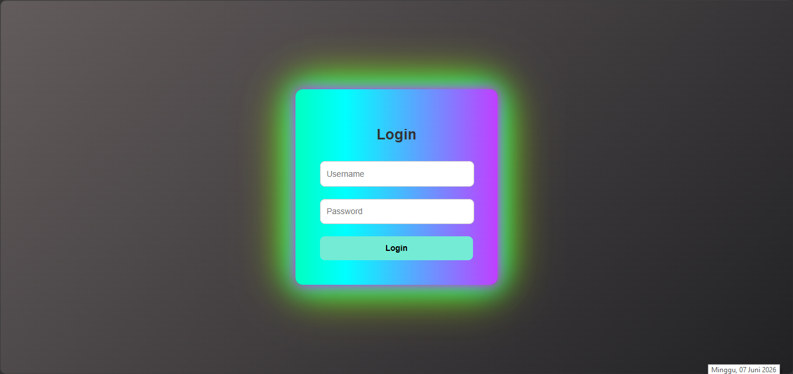

# ⚡ Neon Gradient Login Page with Loading Animation

A modern login page featuring a neon gradient UI combined with a smooth loading animation.  
Built using HTML, CSS, and JavaScript for practicing modern front-end design and animations.

---

## ✨ Features
- Neon gradient glowing UI design
- Smooth loading animation before login page appears
- Responsive layout (mobile & desktop)
- Clean and modern interface
- Beginner-friendly code structure

---

## 🖥️ Preview

---

## ⚙️ Technologies Used
- HTML5
- CSS3 (Neon effects + gradients)
- JavaScript (Animation control)
